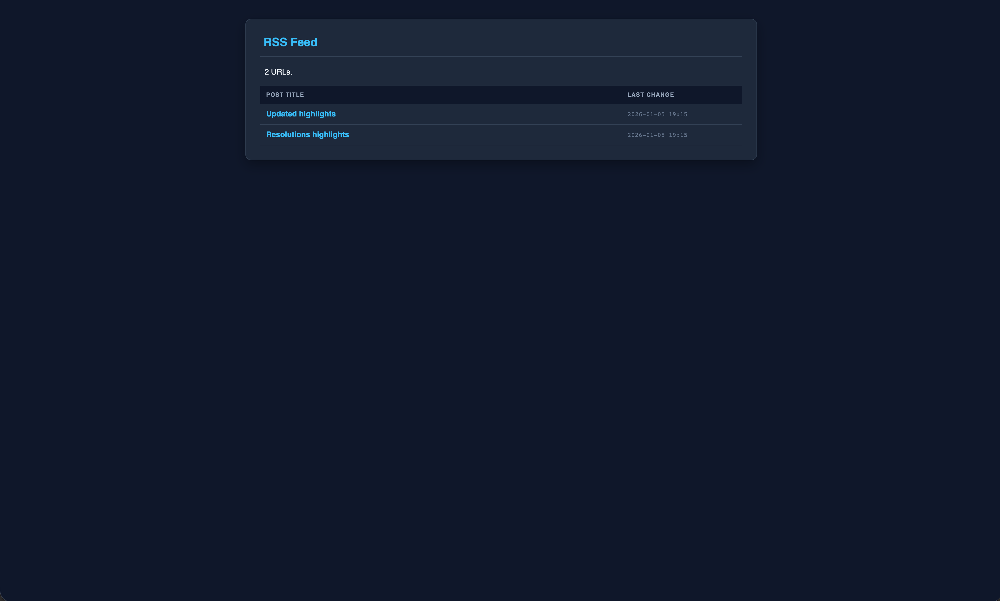

# RSS Reader (XML & XSL) 📰

A lightweight and efficient RSS Feed Reader that utilizes **XML** for data structure and **XSL (Extensible Stylesheet Language)** for transforming and styling the content directly in the browser.

**🌐 [Live Demo](https://dervicblog.github.io/rss/rss.xml)**



## ✨ Features

- **XML Data Handling:** Uses structured XML files to manage feed content.
- **XSL Transformation:** Automatically transforms raw XML data into a clean, readable HTML layout.
- **Dynamic Styling:** CSS integrated within the XSL template for a modern look.
- **Fast Rendering:** Server-side or client-side transformation for quick content display.
- **Responsive Design:** Optimized for all screen sizes (Desktop, Tablet, Mobile).

## 🛠️ Tech Stack

- **XML:** The core format for storing and transporting RSS feed data.
- **XSL/XSLT:** Used to transform XML data into displayable HTML.
- **HTML5 & CSS3:** For the final structure and visual styling.
- **JavaScript:** To handle dynamic fetching and loading of XML files.

## 📂 File Structure

- `rss.xml` - The source file containing the RSS feed items.
- `style.xsl` - The stylesheet that defines how the XML data is rendered.
- `script.js` - Logic for loading and binding XML/XSL files.

## 🚀 How to Run Locally

Because of browser security policies regarding local XML/XSL loading (CORS), it is recommended to run this project using a local server:

1. **Clone the repository:**
   ```bash
   git clone https://github.com
   ```
2. **Run a local server:**
   If you have Python installed, run:
   ```bash
   python -m http.server
   ```
3. **Open in browser:**
   Navigate to `http://localhost:8000`.

## 📝 XML/XSL Example

Your `data.xml` should link to the stylesheet like this:
```xml
<?xml version="1.0" encoding="UTF-8"?>
<?xml-stylesheet type="text/xsl" href="style.xsl"?>
<rss>
  <!-- RSS content here -->
</rss>
```

## 🤝 Contributing

Feel free to fork this project, report issues, or submit pull requests to improve the XSL templates!

## 📄 License

This project is open source and available under the [MIT License](LICENSE).
